# MedChat RAG Pipeline

A specialized, high-performance document processing engine designed to ingest medical text books and papers, converting them into a queryable, structured Retrieval-Augmented Generation (RAG) system.

**Core Mission:**

- **Ingest**: Handle large medical PDFs.
- **Understand**: OCR, parse, and translate specialized content.
- **Index**: Create hybrid semantic search indices (Dense + Sparse) for instant retrieval.

---

## Architecture

The pipeline executes in three distinct, resumable phases, turning raw PDFs into indexed vector knowledge.

```mermaid
%%{init: {'theme': 'dark', 'themeVariables': { 'fontSize': '16px', 'fontFamily': 'Inter', 'lineWidth': '2px'}}}%%
flowchart TD
    classDef main fill:#2C3E50,stroke:#fff,stroke-width:2px;
    classDef phase1 fill:#8E44AD,stroke:#fff,stroke-width:2px;
    classDef phase2 fill:#27AE60,stroke:#fff,stroke-width:2px;
    classDef phase3 fill:#2980B9,stroke:#fff,stroke-width:2px;
    classDef error fill:#C0392B,stroke:#fff,stroke-width:2px,stroke-dasharray: 5 5;
    classDef decision fill:#F39C12,stroke:#000,stroke-width:2px,color:#000;
    classDef db fill:#34495E,stroke:#fff,stroke-width:2px;

    Start([Start: rag-main.py CLI]) --> Init[Initialize: Load .env, Config, Logging]
    Init --> InputPrompt[/Prompt: Input Path or URL/]
    InputPrompt --> InputType{Check Input Type}
    
    InputType -- URL --> URLRes[resolve_pdf_path / download]
    InputType -- GDrive --> GDDown[download_google_drive_file]
    InputType -- Local Dir/File --> Local[Validate Local Path]
    
    URLRes --> ProcessLoop[Start Processing Pipeline]
    GDDown --> ProcessLoop
    Local --> ProcessLoop

    subgraph Phase1 [Phase 1: Splitting & Metadata]
        direction TB
        P1_Start(Start Splitter) --> P1_Init[Copy PDF to database/raw]
        P1_Init --> P1_CheckQ{check_qdrant_existence?}:::decision
        
        P1_CheckQ -- "Exists & Overwrite=False" --> P1_Skip[Skip / Error: FileExists]:::error
        P1_CheckQ -- "Exists & Overwrite=True" --> P1_Del[Delete Existing Points in Qdrant]
        P1_CheckQ -- "New File" --> P1_Meta
        
        P1_Del --> P1_Meta[extract_metadata]
        P1_Meta --> |First 15 pages| MistralUpload[Mistral OCR Upload]
        MistralUpload --> MistralProcess[Mistral OCR Process]
        MistralProcess --> GeminiMeta[Gemini 1.5 Pro + Google Search]
        GeminiMeta --> SaveMeta[Save _metadata.json]
        
        SaveMeta --> SplitLogic[PDFProcessor.split_pdf]
        SplitLogic --> |PyPDF / fallback pdfium2| SaveSplit[Save Split chunks to database/splitted]
    end

    ProcessLoop --> Phase1
    
    subgraph Phase2 [Phase 2: OCR & Parsing]
        direction TB
        P1_Skip --> P2_Start(Start OCR Parser)
        SaveSplit --> P2_Start
        
        P2_Start --> P2_Loop{For each Split PDF}
        P2_Loop --> P2_Upload[Mistral Upload]
        P2_Upload --> P2_OCR[Mistral OCR Request w/ Retries]
        P2_OCR --> P2_SaveRaw[Get Markdown Pages]
        
        P2_SaveRaw --> P2_CheckMeta{Check Metadata Language}:::decision
        P2_CheckMeta -- "Vietnamese" --> P2_Trans[Gemini Flash Translation]
        P2_CheckMeta -- "English/Other" --> P2_Chunk
        
        P2_Trans --> P2_Chunk[RecursiveCharacterTextSplitter]
        P2_Chunk --> P2_Save[Save _full.md & _chunks.json]
        P2_Save --> P2_Loop
    end

    Phase1 --> Phase2

    subgraph Phase3 [Phase 3: Embedding & Indexing]
        direction TB
        P3_Start(Start Embedding) --> P3_Conn[QdrantManager.check_connections]
        P3_Conn -- Fail --> P3_Stop[Stop Pipeline]:::error
        P3_Conn -- OK --> P3_Init[init_collection: Dense + BM25 Config]
        
        P3_Init --> P3_Loop{For each _chunks.json}
        P3_Loop --> P3_Load[Load Metadata & Chunks]
        P3_Load --> P3_CheckID{Check Content ID}:::decision
        
        P3_CheckID -- "Exists & Overwrite=False" --> P3_SkipFile[Skip File]
        P3_CheckID -- "New or Overwrite" --> P3_Batch[Batch Process]
        
        P3_Batch --> |Parallel| P3_Dense[Gemini Embedding 001]
        P3_Batch --> |Parallel| P3_Sparse[SPLADE / BM25 Sparse]
        
        P3_Dense & P3_Sparse --> P3_Upsert[Qdrant Upsert Points]
        P3_Upsert --> P3_Loop
    end

    Phase2 --> P3_Start
    P2_Loop -- Done --> P3_Start

    P3_Loop -- Done --> P3_Verify(verify_and_retry_indexing)
    
    subgraph Verification [Final Verification]
        P3_Verify --> VerifyCount{Count vs Expected}:::decision
        VerifyCount -- Match --> VerifyOK[Log Success]
        VerifyCount -- Mismatch --> VerifyRetry[Retry Missing Chunks]
        VerifyRetry --> P3_Batch
    end

    VerifyOK --> Cleanup[cleanup_temp_files]
    Cleanup --> Finish([End Pipeline])

    class Start,Finish main;
    class P1_Start,P1_Init,P1_Meta,MistralUpload,MistralProcess,GeminiMeta,SaveMeta,SplitLogic,SaveSplit,P1_Del phase1;
    class P2_Start,P2_Upload,P2_OCR,P2_SaveRaw,P2_Trans,P2_Chunk,P2_Save,P2_Loop phase2;
    class P3_Start,P3_Conn,P3_Init,P3_Load,P3_Batch,P3_Dense,P3_Sparse,P3_Upsert,P3_Loop,P3_Verify,VerifyRetry phase3;
    class QdrantDB db;
```




### Directory Structure

```text
rag-pipeline/
├── rag-main.py                 # Main Orchestrator (CLI Entry Point)
├── pyproject.toml              # Dependency Definitions
├── .env                        # Configuration secrets
├── modules/                    # Core Logic
│   ├── splitter_metadata.py    # Phase 1: Splitting & Metadata
│   ├── ocr_parser.py           # Phase 2: OCR & Chunking
│   ├── embedding_qdrant.py     # Phase 3: Embedding & Indexing
│   └── utils/                  # Helpers (Logging, File I/O)
├── database/                   # Data Persistence
│   ├── raw/                    # Input PDFs
│   ├── splitted/               # Split Segments
│   └── parsed/                 # JSON/MD Outputs
├── models/                     # Local Model Cache (Sparse Splade)
└── prompts/                    # LLM Prompts
```

### Technology Stack

| Category | Technology | Usage |
| :--- | :--- | :--- |
| **Language** | Python 3.11+ | Core logic and orchestration. |
| **OCR** | Mistral AI | State-of-the-art text & image extraction. |
| **LLM** | Google Gemini | Metadata (2.5 Pro with Google Search), Translation (2.0 Flash), Embeddings(gemini-embedding-001). |
| **Vectors** | Gemini + SPLADE | Hybrid Dense (Semantic) + Sparse (Keyword). |
| **DB** | Qdrant | High-speed vector storage. |
| **Tooling** | `uv`, `LangChain` | Package management and text chunking. |

---

## Pipeline Phases

### Phase 1: Smart Splitting

**Purpose:** Break down monolithic textbooks into manageable chunks (~50MB or 500 pages) and extract metadata.

- **Process:**

  1. Validates input PDF.
  2. Splits based on size/page limits.
  3. **Metadata Extraction:** Uses Gemini to read the first few pages and extract:
      - Author, Book Name, Publish Year (cross-referenced with Google Search).
      - Keywords (disease, symptom, drug, etc.).
- **Outputs:** `database/splitted/{filename}(page_X-Y).pdf` and corresponding `_metadata.json`.

### Phase 2: OCR & Parsing

**Purpose:** Convert PDF segments into structured markdown and text chunks.

- **Process:**

  1. **OCR:** Uploads to Mistral OCR API to extract text and images (as base64).
  2. **Translation (Optional):** Detects Vietnamese medical content and translates to English using Gemini Flash.
  3. **Cleaning:** Formats text into clean Markdown.
  4. **Chunking:** Splits text into 1000-char overlapping windows (RecursiveCharacterTextSplitter).
- **Outputs:** `database/parsed/{filename}_full.md` and `_chunks.json`.

### Phase 3: Embedding & Indexing

**Purpose:** Map text chunks to vector space and store in Qdrant.

- **Process:**
  1. **Dense Embedding:** Generates 1536-dim vectors using `gemini-embedding-001`.
  2. **Sparse Embedding:** Generates keyword weights using `SPLADE++` (BM25-style).
  3. **Indexing:** Upserts to Qdrant with a unique hash ID for deduplication.
  4. **Verification:** Verifies 100% of chunks are indexed.

---

## Installation & Setup

We use **uv** for fast dependency management.

1. **Prerequisites:** Python 3.11+, `uv` installed.
2. **Install Dependencies:**

    ```bash
    uv sync
    ```

3. **Configuration (.env):**
    Copy `.env.example` to `.env` and fill in your keys.

| Variable | Description |
| :--- | :--- |
| `MISTRAL_API_KEY` | Mistral OCR API Key |
| `GOOGLE_CHAT_API_KEY` | Gemini API Key for Translation/Metadata using free tier key |
| `GOOGLE_EMBEDDING_API_KEY` | Gemini API Key for Embeddings using tier 1 key for better performance |
| `QDRANT_API_KEY` | Qdrant self-hosted API Key |
| `SERVICE_URL_QDRANT` | Qdrant Cluster URL with Coudflare Tunnels |

---

## Usage Guide

Run the pipeline via the CLI. It handles local files, folders, and URLs (including Google Drive).

### Basic Execution

```bash
# Interactive mode
uv run python rag-main.py

# Direct file path
uv run python rag-main.py "path/to/textbook.pdf"
```

### Advanced Usage

```bash
# Run specific phase (e.g., only embedding)
uv run python rag-main.py "file.pdf" --phase 3

# Process an entire folder
uv run python rag-main.py "path/to/folder/"

# Clean up temporary files after success
uv run python rag-main.py "file.pdf" --clean 1
```

---

## Module Reference

### 1. splitter_metadata.py

#### Class: PDFProcessor

Basic handler for reading PDF properties and managing split ranges.

#### Functions (splitter_metadata)

- `extract_metadata(file_path)`: Calls Gemini to analyze PDF content and fetch metadata.
- `run_splitter(path)`: Orchestrates the splitting validation and execution.

### 2. ocr_parser.py

#### Class: RateLimitTracker

Manages API throttling (e.g., Mistral 20 req/min).

#### Functions (ocr_parser)

- `upload_pdf(client, path)`: Handles file upload to Mistral.
- `process_file(path)`: Main logic for OCR -> Translation -> Chunking.

### 3. embedding_qdrant.py

#### Class: QdrantManager

- `init_collection()`: Configures Qdrant collection with Dense + Sparse vectors.
- `process_batch(batch)`: Handles parallel embedding generation and upsertion.
- `check_connections()`: Validates API connectivity before starting.

### 4. Utilities

- **file_utils**: parsing Google Drive URLs, downloading files.
- **translator**: Batch translation using Gemini Flash with backoff.
- **qdrant_verifier**: Post-indexing check to ensure data integrity.

---

## Cost Analysis (Estimate)

| Component | Cost Factor | Estimate (per 1k pages) |
| :--- | :--- | :--- |
| **Mistral OCR** | $10 / 1k pages | Free (using experimental plan) |
| **Gemini Flash** | Translation (Input/Output) | ~$0.20 |
| **Gemini Embed** | Text Embedding | < $0.05 |
| **Qdrant** | Storage | Free tier (Self-hosted)  |

*Note: Mistral OCR is the primary cost driver. Use wisely.*
